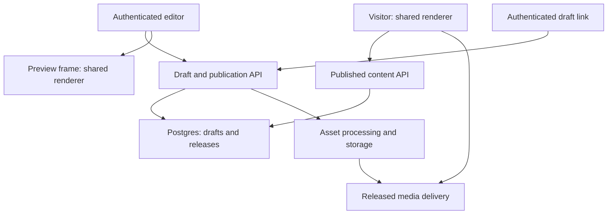

# Birthday Afnan — Website and Visual Editor Architecture

Prepared: 1 October 2026 (Asia/Kolkata). Repository: https://github.com/Dellybizz/birthday-afnan- . Status: proposed architecture, not an implementation or deployment certificate.

## 1. Objective and architectural decision

Build a responsive birthday website and an authenticated control panel in which every intended editable part has a discoverable control. The administrator manages personal information, pages, navigation, text, media, layout, appearance and behaviour through a Shopify-style editor. Changes appear immediately in a preview, remain private when saved, and reach visitors only when published.

Use a **schema-driven content system with one shared renderer**. Registered components declare their fields, allowed children, defaults, validation and editor groups. The same definition powers the inspector, preview, server validation and public rendering. Avoid a separate hand-built admin form for each public page: that approach causes missing controls and preview mismatches.

This is a custom application inspired by Shopify's modular editor patterns, not a Shopify installation or a requirement to use Liquid. Shopify's documented section and block architecture supports modular composition and schema-defined settings [S1–S3]. The deeper hierarchy and publishing workflow below are recommendations for this project.

### Recommended stack

| Layer | Recommendation | Reason |
| --- | --- | --- |
| Public frontend | React + TypeScript, built with Vite | Interactive birthday pages and a reusable component renderer; a static build is sufficient initially |
| Admin frontend | Separate React entry/build using the same renderer package | Keeps editor dependencies out of the public bundle |
| Schemas | Shared TypeScript definitions plus runtime validation, such as Zod | Reject invalid data on both client and server; runtime checks are essential |
| Editor state | Command reducer/store with reversible operations | Predictable undo, redo, selection and structural changes |
| Structured persistence | Existing Supabase PostgreSQL, JSONB documents plus relational metadata | Reuses the repository's backend and preserves coherent document snapshots |
| Authentication | Supabase Auth with invite-only administrator membership | Named accounts, recovery and revocable access replace shared-key daily login |
| Backend | Supabase Edge Functions and narrow transactional database operations | Reuses the current deployment shape; privileged operations stay server-side |
| Media | Supabase Storage: private originals/drafts and explicitly released derivatives | Separates assets from content and prevents accidental draft exposure |
| Hosting | Static HTTPS hosting for public/admin builds plus a small same-origin API gateway where cookies or private preview streaming require it | Hosting vendor remains selectable; no unnecessary frontend server requirement |
| Verification | Unit/contract tests and browser flow tests | Tests the controls, renderer and actual publishing boundary |

Pin compatible dependency versions and commit the lockfile during implementation. No current package versions, provider plan prices or live infrastructure are assumed in this document. If private birthday delivery is selected, the hosting must support authenticated content/media access rather than relying solely on public static assets.

## 2. Verified repository baseline

Read from the default `main` branch through GitHub: README, repository tree, `admin/index.html`, `admin/editor.js`, `setup/bootstrap.sql`, and both Edge Function sources. This is source inspection only; database migrations and live deployment have not been certified.

| Existing capability | Architectural treatment |
| --- | --- |
| Empty document with `schemaVersion`, `general`, `pages`, `menus` | Preserve the shape through an explicit versioned migration |
| Globally unique node IDs, title/type/enabled/settings/children | Retain stable IDs and add a typed component registry |
| Plain JSON textarea, load/add page/undo/redo/publish | Replace daily editing with visual controls; keep safe JSON export/import for advanced recovery |
| Admin-key authorization, key rotation and rate limiting | Reuse where suitable during transition; move ordinary administration to named Auth users |
| Revision-checked publish endpoint | Extend to private drafts, immutable releases and idempotent publishing |
| History-related RPC calls | Inspect and reconcile migration contracts before relying on them |
| MIME/extension/signature validation for uploads | Retain validation and add direct resumable uploads, metadata extraction and processing states |
| Public `birthday-media` bucket | Replace private draft delivery; public release copies must be an explicit publication decision |
| Media references examined in live/history | Expand to saved drafts, releases, preview snapshots and pending jobs |
| Uploads accept a configurable folder; deletion only accepts `birthday-afnan/` | Standardise site-scoped paths and validate them consistently |
| Media listing performs a reference query per item | Replace with paginated batched metadata/reference queries |
| Server validator limits document to 1 MiB, 2,000 nodes and depth 5 | Preserve initial safety limits and clarify depth counting in the new contract |

The repository does not currently provide the public website, typed field inspectors, a visual preview, private draft saving or an authenticated preview-link system. The README also says the extracted starter has not been connected or deployed; this has not been independently checked against a live project.

## 3. System boundaries and data flow



The editor owns temporary editing state. The database owns saved drafts and releases. The public loader retrieves only the active release. Preview loaders retrieve a specifically authorised draft/snapshot. The asset service decides whether a requested asset is visible in that context. The browser never receives a service-role credential.

Keep public, preview and editor entry points separate. A `?preview=true` parameter must never change public data access. All access is checked at the API/database boundary.

## 4. Content and navigation hierarchy

| Level | Example | Responsibility |
| --- | --- | --- |
| Site | Birthday Afnan | Identity, theme, timezone, access policy, global music and navigation |
| Page/application | Home, Gallery, Movie | Route, title, shell, page settings and section order |
| Section | Greeting, photo gallery, video player | Major page region and its layout |
| Subsection/block | Gallery row, photo card, message card | Repeated or nested content unit |
| Element | Heading, paragraph, image, button | Individual editable semantic output |
| Menu | Main menu, app launcher, footer | Separate navigation tree referencing pages/actions |
| Menu item/submenu | Gallery shortcut, nested media menu | Label, icon, target, visibility and order |

Use `kind` for structural role and `type` for a registered component key. For example, `kind: "element", type: "media.image"`. A page may contain sections; a section contains blocks or elements; registered container blocks may hold another block level. Leaf elements cannot contain children. Define allowed child kinds/types in the registry. Menus are navigation containers, not arbitrary page-layout children.

Set a layout maximum of five node levels counting page as level 1: page → section → block → nested block → element. Menus permit up to three item levels below the menu root. Enforce cycles, uniqueness and size limits across the complete document. Showing/hiding a parent affects rendering of its descendants, but their saved content remains intact.

Do not encode data IDs in filenames or selectors. Many gallery items use one `PhotoCard` component. Use stable IDs for references and `data-editor-node-id` for selection. On subtree duplication generate fresh IDs and remap references that point inside the copied subtree; preserve external asset and page references unless the administrator chooses otherwise.

### Document example

```json
{
  "schemaVersion": 2,
  "registryVersion": 1,
  "siteId": "site_afnan",
  "general": {
    "name": "Afnan",
    "nickname": "",
    "birthdayDate": "2026-10-10",
    "timezone": "Asia/Kolkata",
    "locale": "en",
    "music": { "enabled": false, "playlistId": null },
    "appearance": { "themePreset": "soft", "accent": "#B44968" }
  },
  "pages": [{
    "id": "page_home",
    "kind": "page",
    "type": "page.standard",
    "title": "Home",
    "enabled": true,
    "settings": { "slug": "/", "shell": "default" },
    "children": [{
      "id": "section_greeting",
      "kind": "section",
      "type": "section.greeting",
      "title": "Birthday greeting",
      "enabled": true,
      "settings": { "backgroundColor": "#FFF7F2" },
      "style": { "base": { "paddingBlock": 32, "radius": 24 } },
      "children": [{
        "id": "element_heading",
        "kind": "element",
        "type": "text.heading",
        "title": "Greeting heading",
        "enabled": true,
        "settings": { "text": "Happy birthday, {{general.name}}", "level": 1 }
      }]
    }]
  }],
  "menus": [{
    "id": "menu_main",
    "kind": "menu",
    "type": "navigation.menu",
    "title": "Main navigation",
    "enabled": true,
    "settings": {},
    "children": [{
      "id": "item_home",
      "kind": "menuItem",
      "type": "navigation.item",
      "title": "Home",
      "enabled": true,
      "settings": { "label": "Home", "target": { "kind": "page", "pageId": "page_home" } }
    }]
  }]
}
```

Values are illustrative defaults, not confirmed personal information. Retain existing `birthdayISO` through a migration: convert only valid values and ask for correction of ambiguous dates. Birthday calendar dates and a timed reveal are separate: `birthdayDate` is date-only; `revealAt` is a UTC instant calculated from the chosen timezone. Store annual recurrence explicitly if required.

Text bindings are allowlisted field references such as `general.name`; no JavaScript evaluation. Rich text uses a structured document with allowed marks and link types, never unrestricted executable HTML.

## 5. Component registry and complete control coverage

Each component definition lives beside its renderer and includes:

- Stable type, schema version, structural kind and display name.
- Field definitions with stable IDs, labels, groups, defaults, units, bounds and help text.
- Allowed child types, child counts, presets and supported actions.
- Renderer, shared validator and migration function.
- Asset-reference extractor and page/action-reference extractor.
- Responsive capabilities, accessibility constraints and empty/loading/error states.
- Explicit declaration of editable fields versus internal implementation details.

For example, `media.image` declares an `assetId` picker, alternative text, ratio, fit and focal point; the inspector automatically displays those controls. A component claiming editable padding must consume the same validated padding field when it renders. Build a registry coverage check to catch unused controls and missing field declarations.

### Settings catalogue

| Group | Controls and applicable behaviour |
| --- | --- |
| Site identity | Name, nickname, birthday date, timezone, locale, greeting templates, favicon, site title and social share image |
| Site access | Public/private birthday delivery, reveal time, waiting screen and server-enforced access where needed |
| Theme | Palette, accent, text/surface colors, approved fonts, type scale, spacing scale, radii, border/shadow presets, light/dark preference |
| Page | Title, slug, shell, visibility, menu inclusion, background, max width, page padding, scroll behaviour and metadata |
| Structure | Add, duplicate, delete, reorder, move to another valid parent/page, rename editor label, enable/disable and lock against accidental editing |
| Text | Heading/subheading/paragraph, semantic heading level, alignment, size, weight, line height, letter spacing, color, emphasis, link and variable binding |
| Media selection | Upload, choose existing, replace, remove, inspect metadata, title, caption, credit, alt text and mobile-specific asset |
| Media layout | Natural/custom/1:1/4:3/3:2/16:9/9:16 ratio, width/max width, auto height, cover/contain, focal point, crop preview, letterbox color and radius |
| Video | Poster, captions, controls, muted autoplay request, loop, inline playback, preload policy and player fallback |
| Audio/music | Playlist order, title, artist label, cover, start track, volume, loop, play/pause, remembered mute and whether global music resumes after a video |
| Box/layout | Padding and margin per side, width/max width, gap, grid columns, alignment, flex/grid preset, border color/width/style, radius and shadow |
| Background | Solid color, approved gradient, image, position, overlay color/alpha and background blur where supported |
| Transparency | Separate background alpha and whole-element opacity; warn that whole-element opacity also fades text/children |
| Navigation | Menu/submenu CRUD, order, label, icon, page/anchor/action target, external link policy, active state and mobile drawer behaviour |
| Buttons/actions | Label, icon, style, size, disabled state and registered action such as navigate/open modal/play audio |
| Motion | Preset, duration, delay, easing, trigger, repeat and reduced-motion substitute |
| Responsive | Inherited base values plus tablet/desktop overrides, reset override, responsive visibility and preview breakpoint |
| Interaction | Gallery lightbox, carousel controls, accordions, modal close behaviour, hotspot actions and permitted quiz/shop interactions |
| Accessibility | Alt text, decorative image flag, captions, accessible labels, focus and contrast validation |

Only show controls the component supports. A paragraph should not show a video-loop control. Advanced controls are collapsed, with a reset-to-default action and a clear indicator for overrides. Unit inputs use typed lengths; allow px, %, rem and auto only where appropriate. Initial limits: padding 0–160 px, margins −64–160 px only on components that support negative margins, radius 0–80 px and opacity 0–1. These are adjustable project policy limits, not standards.

Prefer explicit container background alpha to unreadable low-opacity text. Allow token references or custom validated values. Approved actions form a discriminated union; do not store arbitrary scripts, handlers, CSS selectors or unrestricted styles in content.

### Optional birthday modules

Build generic sections first: hero/greeting, text, image, gallery, video, playlist, countdown, cards and buttons. Optional presets can include reasons cards, birthday movie, hotline messages, future adventures, birthday radio and a playful kiss-coupon shop. These names are optional content choices, not assumptions about the final website. A coupon shop uses local playful interactions unless a server-backed redemption feature is specifically added; payments are outside this scope.

## 6. Backend code organisation

Use a modest workspace structure; it does not require a complex build orchestrator.

| Path | Responsibility |
| --- | --- |
| `apps/public/src/routes/` | Public routes, active-release loading and error states |
| `apps/public/src/features/` | Public navigation, audio coordination, visitor preferences |
| `apps/admin/src/editor/` | Outline, canvas, inspector, toolbar, command history and save state |
| `apps/admin/src/features/` | Dashboard, media library, release history, access and settings |
| `packages/content/src/document/` | Document schema, traversal, IDs, bindings and migrations |
| `packages/content/src/registry/` | Component registration and typed field definitions |
| `packages/renderer/src/pages/` | Page shells and route renderers |
| `packages/renderer/src/sections/` | Named section renderers |
| `packages/renderer/src/blocks/` | Reusable nested/repeated blocks |
| `packages/renderer/src/elements/` | Text, media, buttons and other leaf components |
| `packages/renderer/src/navigation/` | Menus, menu items and submenu rendering |
| `packages/ui/` | Shared accessible buttons, dialogs, inputs and tokens |
| `packages/contracts/` | API request/response schemas and preview messages |
| `supabase/functions/site-content/` | Public release reads and private preview reads |
| `supabase/functions/site-admin/` | Draft saves, publish, rollback and preview grants |
| `supabase/functions/site-media/` | Upload authorisation, metadata and deletion orchestration |
| `supabase/functions/_shared/` | Authentication, permissions, validation, errors and logging |
| `supabase/migrations/` | Reviewed database changes and permission definitions |
| `tests/` | Registry, API, database, browser and accessibility tests |
| `docs/` | Architecture, operational runbook and content-authoring guidance |

For a section, colocate `definition.ts`, `schema.ts`, `Renderer.tsx` and any special inspector control. The normal inspector is generated from fields. Backend domain modules mirror the hierarchy with document/page/section/block/element/menu services, but mutations operate on one validated document transaction. Avoid separate physical tables or network endpoints for every paragraph.

Dependency rule: renderer depends on content and UI; editor depends on renderer/content/contracts; backend depends on content/contracts; content never depends on browser APIs or admin components. Server validators must execute in the Deno runtime used by Edge Functions.

## 7. Persistence model

Use relational tables for ownership, revisions, access and asset lifecycle; store each small site document as JSONB. This gives coherent snapshots without dozens of reads to reconstruct a page.

| Table | Core fields and purpose |
| --- | --- |
| `sites` | ID, owner, name, active release ID, publication sequence, access mode and timestamps |
| `site_members` | Site ID, Auth user ID, role; unique membership pair |
| `site_drafts` | Draft ID, site ID, document JSONB, revision, base release ID, editor and timestamps |
| `site_draft_versions` | Named/periodic saved draft snapshots, author, checksum and schema version |
| `site_releases` | Immutable document, source draft/revision, renderer compatibility version, checksum, author, published time |
| `assets` | Site ID, asset ID, source key, MIME, bytes, hash, dimensions/duration, processing status and trash time |
| `asset_variants` | Asset ID, variant key, format, dimensions and private/public delivery state |
| `asset_refs` | Asset ID, owner kind/ID, node ID and field path; includes draft, snapshot and release references |
| `preview_grants` | Hashed opaque grant, site/draft or snapshot scope, allowed role/user scope, expiry and revocation |
| `publish_requests` | Site ID, idempotency key, request hash, status, selected draft revision, resulting release ID |
| `jobs` / `outbox_events` | Durable processing/release tasks, attempts, next attempt and deduplication key |
| `audit_events` | Actor, site, operation, target IDs, result and time; never raw secrets |

Use foreign keys and site-scope checks. Add indexes for site membership lookup, draft ownership, site/release order, asset listing, reference owner and expiry/job status. Only one active draft is necessary initially; multiple named drafts can be added later. IDs and revision integers are distinct: node IDs remain stable while revision counters advance.

Expose public content through a narrow endpoint that returns only the active release and visitor-safe settings. Admin membership, audit events, upload keys, drafts and preview grants are never part of that payload. Do not put passwords or secrets inside document JSON.

Enable RLS on exposed tables and explicit grants; authentication alone is insufficient without site membership checks [S4]. Public users can read only active visitor-safe release content. Draft reads/writes require site membership. Asset access checks both site and referenced publication context. Restrict privileged database functions and service-role operations to the minimum needed.

## 8. Editor interface and live preview

Desktop layout: top toolbar; searchable hierarchy on the left; responsive preview in the centre; grouped inspector on the right. Tablet layouts collapse one side panel. Phone editing switches between outline, preview and settings rather than squeezing three columns.

Toolbar: page selector, device width, preview/interact mode, undo, redo, save status, Save changes, Open private preview, Publish and release history. Show which draft/release is being viewed. An unpublished-changes badge remains visible until the saved document matches the active release.

Clicking an outline node selects and scrolls to its renderer output. Clicking the preview selects its editable node and opens its inspector. Show a breadcrumb such as `Home › Gallery › Photo card › Caption`. In interaction mode, clicks perform normal page actions; selection mode intercepts them. Use explicit mode controls to avoid buttons navigating while the administrator is trying to select them.

Maintain stable component keys and local updates; avoid reloading the entire iframe for every keystroke. Set safe presets, inline validation, disabled unsupported actions, confirmation for subtree deletion, and move-up/move-down buttons alongside drag-and-drop. Provide empty states with an Add section action, missing-media fallbacks and retry controls.

### Preview transport

Render a dedicated preview entry in an iframe using the shared renderer and the exact editor build version. Use versioned, schema-validated `postMessage` envelopes: `READY`, `SET_DOCUMENT`, `APPLY_COMMAND`, `SELECT_NODE`, `NAVIGATE_PAGE`, `ACK` and `ERROR`. Include preview instance ID and monotonically increasing update sequence; discard stale sequences and resynchronise from a full document when necessary.

Set an exact target origin and validate incoming origin, source window and message schema [S7]. Never send privileged credentials in messages. A preview is read-only at the backend; public interactive forms or redemptions are disabled or simulated. Show any simulated reveal-date override as a clear preview-only banner.

Allow only the capabilities the frame needs. If it runs same-origin scripts with both `allow-scripts` and `allow-same-origin`, iframe sandboxing is not a strong security boundary; content must remain trusted and sanitised. Use a separate preview origin if stronger isolation is needed. Configure CSP `frame-ancestors` for only the admin origin, and prevent unrelated sites framing the admin.

## 9. Undo, redo and saving

Every mutation is a command: set field, insert node, remove subtree, move node, duplicate subtree, update menu or change site setting. Store reversible patches or bounded before/after snapshots. Group typing into one command until blur or a short idle boundary, and group slider drags from pointer-down to pointer-up. One subtree deletion is one undo entry. New edits after undo clear redo history.

Suggested limit: 100 commands with an additional 5 MiB memory budget. Keyboard shortcuts must respect active text-input native undo; use explicit toolbar actions everywhere. Undo affects editor content, not irreversible physical asset deletion or published releases. Upload selection can be undone while the underlying upload remains an unused asset.

Saving writes a private server draft. Autosave after approximately one second of inactivity, with a maximum interval during continuous editing; manual Save flushes immediately. Serialise saves per draft. Each save includes `expectedRevision`, a mutation ID and the complete validated document initially. The server atomically updates only the matching revision, increments it and returns the new revision.

Track the document sequence included in each save: an acknowledged older save must not mark later edits as saved. Display Unsaved, Saving, Saved, Offline, Conflict or Failed. Retries reuse mutation IDs so a lost response cannot duplicate a save. Do not silently overwrite a newer draft from another tab/device. A conflict offers compare/reload/save as another draft; field-level merge is a later feature.

Keep a bounded recovery copy in IndexedDB keyed by site, user and draft. It is recovery support, not the canonical saved state. Show recovery and server versions when they diverge. Purge sensitive local drafts on logout where practical; browser storage cannot protect against a compromised device. Navigation warns only when changes have not reached either the server or recoverable local storage, with a clear status.

## 10. Save, publish, rollback and deployment

Content publication and application-code deployment are different operations. Normal name/text/media/layout changes publish a new content release without rebuilding the app. New component types require a tested code deployment first.

### Publication protocol

1. Flush current editing commands to the server and retain the exact acknowledged draft ID/revision.
2. Submit Publish with that revision, expected current publication sequence and idempotency key.
3. Authorise the publisher and reserve the request. Validate the full document, routes, registry compatibility, references and all assets. Block missing required assets, unsupported component types and invalid internal links. Show nonblocking warnings separately.
4. Prepare media delivery outside the database transaction. For public sites, copy only referenced, ready derivatives to immutable release-scoped public keys. Originals and drafts stay private. A preparation job alone must not activate the release.
5. In one short transaction, lock/check the site and source draft, reject stale revisions, insert the immutable release and its references, advance the active release pointer/publication sequence, write the audit/outbox record and complete the request. PostgreSQL transaction/locking facilities support serialising this transition [S9].
6. Return the committed release ID and publication sequence. Cache invalidation is a retriable outbox task. If the response is lost, the client retrieves the existing idempotent result.

Editing during publication may continue, but if the source revision changes before commit the default is a conflict, not publishing an unspecified newer version. Optional explicit snapshot publication can be added later. Two publishers cannot both advance the same expected sequence. Content becomes active only after prerequisites are ready.

Public copies made during preparation may be retrievable if their URL leaks; unguessable names do not make them private. For strict embargoes, serve even prepared release assets through an authorisation gateway until activation. This tradeoff must be explicit.

Rollback creates a new release/publication event using a previously compatible document and retained assets; it never edits historical records. Warn before publishing if a code deployment removes support for an older component version. Prefer backward-compatible renderers and explicit document migrations.

Scheduled publication is optional: schedule a fixed saved snapshot, evaluate time server-side, revalidate assets/permissions, and use the same idempotent protocol. A client clock is never the authority for a protected birthday reveal.

## 11. Admin-only unpublished site link

Provide `/preview/<opaque-id>` as the user-facing draft link. Possessing it does not grant access. On every draft-content request require an authenticated user with the appropriate site membership, then verify the hashed grant's scope, expiry and revocation. Start with a 24-hour expiry and an owner-controlled revoke/renew action.

Offer two modes: **latest saved draft**, which updates after saves, and **fixed snapshot**, which provides reproducible review. Unsaved edits appear only in the editor canvas, not in a separate link. Display draft/snapshot ID, save time and an Unpublished banner. Anonymous visitors are sent to admin login, then redirected only to validated same-site paths.

Use `Cache-Control: private, no-store`, `X-Robots-Tag: noindex, nofollow`, a restrictive referrer policy and no public service-worker caching for preview HTML, JSON or personal media. Exclude previews from sitemaps and analytics. Robots directives are additional hygiene, not access control.

Media requests require preview membership and asset-reference checks. A signed storage URL is a temporary bearer URL and can be shared until expiry [S5–S6]. For strict admin-only delivery use an authenticated media gateway with Range support for video/audio; short-lived signed URLs are a lower-complexity option with that limitation clearly stated. Revoking a grant does not automatically invalidate already-issued storage URLs.

## 12. Media management and playback

Upload flow: request a site-scoped upload intent → receive restricted upload authority → upload directly to private storage → finalise intent → verify the stored object → extract metadata/process derivatives → mark ready. Prefer resumable uploads for large media [S6]. Progress, retry, cancellation and processing status appear in the library. Attach only ready variants to a publishable release.

Use immutable keys such as `sites/<siteId>/assets/<assetId>/original.<ext>` and derivative IDs. Replacing an image creates a new asset ID; old releases remain reproducible. Store asset IDs in document fields, not signed URLs. The delivery adapter resolves the appropriate variant for live/preview context.

Check permitted MIME, extension and signature; verify final object byte size and checksum; apply bucket limits, upload intent expiry and site quota. SVG is excluded initially unless safely sanitised. Keep original metadata private and strip location/EXIF metadata from visitor derivatives. Select upload limits after confirming provider constraints; the inherited 100 MiB function limit is not evidence that all files of that size are operationally safe.

Create image variants and thumbnails, video poster images, captions and compressed audio where appropriate. Heavy video transcoding belongs in a durable media worker/service, not a request-bound Edge Function. Until such a worker exists, require suitable web-ready video and display processing limits clearly. Keep source originals for export and regeneration.

The library includes search, filter by type, paginated grid, folders/tags, metadata inspector, asset usage by page/node, bulk selection, replacement and trash. A folder name is organisational, never authorisation. Display all retained references before removal. Trash assets only when unreferenced; purge after a proposed 30-day grace period and a second reference check. Coordinate purge versus attachment/publication through an asset lifecycle lock/reservation. Do not preserve the existing unrestricted force-delete behaviour for active release assets.

Deleting content removes its references when that saved version is no longer retained; it does not immediately delete media. Historical releases retain references until their explicit retention policy expires. Draft snapshot retention and media retention must be managed together.

### Music coordinator

One site-level audio controller owns playback. Persist visitor mute/volume preferences locally, separate from admin defaults. An explicit visitor interaction starts audible playback; handle rejected playback promises and display a Play button because autoplay with sound is often restricted [S8]. Pause global music during a video/hotline clip, then resume only when previous visitor intent allows it. Switching pages must not create duplicate players. Support pause, seek where suitable, previous/next, playlist order and graceful missing-file handling.

## 13. Responsive rendering and accessibility

Build mobile-first with proposed base under 768 px, tablet from 768 px and desktop from 1024 px. These are layout policy, not device detection. Field overrides cascade base → tablet → desktop; absent values inherit, and reset removes the override rather than writing a guessed value.

Use flexible grids, intrinsic media sizes, max-width containers and content-driven breakpoints. Test narrow 320 px layouts, typical phones, tablets, landscape and large desktop windows. Preview widths are useful approximations, not substitutes for real browser checks. Account for safe-area insets, dynamic viewport height, keyboard overlays, long names and translated text.

Aim for WCAG 2.2 AA across public and admin interfaces [S10]. Provide keyboard operation, visible focus, semantic headings, labelled inputs, reduced-motion alternatives and accessible dialogs with focus return. Standard text needs 4.5:1 contrast; large text 3:1. Use at least 44 px practical touch controls where possible; WCAG 2.2 AA target-size minimum has its own 24 CSS px conditions/exceptions. Include move buttons as an alternative to dragging [S11].

Hide duplicate responsive versions from assistive technologies where appropriate; essential content must remain reachable. Captions/transcripts are needed for meaningful prerecorded audio/video. Do not make critical interaction depend solely on sound, color, hover or animation.

## 14. API contracts and permissions

The following paths are conceptual contracts. They can be implemented as action routes in existing Edge Functions or behind a gateway; they are not claims about deployed endpoints.

| Operation | Request essentials | Permission and result |
| --- | --- | --- |
| Read public site | Site/slug | Public or authorised visitor; active release only |
| Read/save draft | Draft ID, expected revision, mutation ID, document | Editor/owner; revision and save timestamp |
| Validate draft | Draft ID/revision | Editor; grouped errors with node/field paths |
| Publish | Saved revision, expected publication sequence, idempotency key | Publisher/owner; release or job/result |
| Read releases/rollback | Site, release ID, expected publication sequence | Publisher/owner; immutable event |
| Create/revoke preview | Draft/snapshot scope and expiry | Editor/owner; opaque URL, never a public draft payload |
| Read preview | Grant ID and authenticated membership | Authorised admin; private saved document |
| Create/finalise upload | Asset metadata, intent ID, checksum | Editor/owner; restricted upload/asset status |
| List/inspect media | Cursor and validated filters | Member; paginated metadata and references |
| Trash/purge media | Asset ID and lifecycle checks | Owner; protected deletion result |
| Manage access/settings | User/role and site policy | Owner; audited changes |

Start with owner and editor roles; add separate publisher/viewer roles only if useful. Enforce permission checks on every request, including media and preview. Recoverable errors use stable codes such as `UNAUTHENTICATED`, `FORBIDDEN`, `REVISION_CONFLICT`, `INVALID_DOCUMENT`, `ASSET_NOT_READY`, `RATE_LIMITED` and `PUBLISH_PENDING`. Return a request ID and field paths; hide raw database errors and credentials.

## 15. Security, privacy and operations

Daily admin login uses an invite-only account, with recovery, session expiry and optional MFA. The public site does not expose a registration path granting admin membership. During key-login transition preserve working access, validate named-account operation, then revoke legacy keys; do not abruptly strand the owner.

Apply site-scoped permissions on the server and RLS. Do not trust editable user metadata for roles. Keep service-role credentials in server secrets only. Use explicit CORS origins, but recognise CORS is not authorisation. If a cookie gateway is used, add HttpOnly/Secure/SameSite cookies, CSRF protection and correct refresh/logout behaviour. If browser-held Supabase sessions are used, prioritise XSS prevention and avoid claiming HttpOnly guarantees.

Sanitise structured rich text and allowed link protocols; reject scripts and dangerous URL schemes. Use a CSP suitable for media delivery and approved fonts. Rate-limit login, upload intents, saves and publish requests without making ordinary editor typing fail. Enforce request-size limits before parsing unbounded payloads. Logs contain IDs/status/timings rather than intimate messages, raw documents, admin keys or signed URLs.

Back up database content and object storage independently. A database backup alone does not restore missing media. Keep exportable JSON documents, asset manifests, schema versions and checksums. Demonstrate restore into a nonproduction environment. Proposed initial goals: content recovery point within 24 hours and restoration within four hours, subject to the selected provider plan and backup tooling.

Monitor save/publish failure rate, revision conflicts, preview authorisation failures, upload errors, processing queue age, broken media, public load timings and storage growth. Audit publish, rollback, access changes and destructive operations. Use separate development/test/production projects or environments; tests never target the live birthday database by default.

## 16. Performance and cache behaviour

Load the public shell and current page first. Fetch one coherent release document for this small site; split by page only when measured document growth justifies it. Lazy-load optional page components, galleries and videos. Do not ship inspector libraries or drag tooling to visitors. Use responsive images, dimensions to prevent layout shift, lazy offscreen media, video posters and metadata-only preload.

Cache immutable release JSON and immutable public asset variants by release/hash. The active-release pointer needs a short explicit TTL or revalidation; propose no more than 30 seconds of expected propagation and expose publication verification. Retrying invalidation is safe. Never cache admin/preview responses in a shared cache. If old pointer data persists, return a coherent old release rather than mixing nodes from two releases.

Set project targets before certification: LCP ≤2.5 s, INP ≤200 ms and CLS ≤0.1 at the 75th percentile when field data exists; these are acceptance goals, not measurements of this starter. Measure on a mid-range phone and constrained connection. Keep editor local preview updates responsive; proposed targets are visible simple edits within 100 ms and draft save acknowledgement under two seconds on a healthy connection. Do not claim these without tests.

## 17. Migration and implementation sequence

| Stage | Deliverable | Exit evidence |
| --- | --- | --- |
| 0. Baseline | Freeze source reference, inspect all inherited migrations/RPCs and document setup | Reproducible new test database; existing state exported |
| 1. Contract | Schema v2, registry, validators, ID/reference utilities and v1 adapter | Every existing valid document converts; malformed documents fail clearly |
| 2. Persistence/access | Named admin membership, private drafts, revisions, releases and asset metadata | Unauthorised draft reads denied; concurrent saves conflict correctly |
| 3. Public renderer | Responsive shell and generic section/block/element/navigation components | Seed document renders on all target layouts with fallback states |
| 4. Visual editor | Outline, selection, inspector, commands, undo/redo and shared preview | All declared fields/actions work; nested reorder/duplicate/delete remain valid |
| 5. Media | Private direct upload, variants, library, references and safe lifecycle | Interrupted upload recovery and protected deletion verified |
| 6. Publication | Save/publish separation, idempotent releases, rollback and admin-only links | Anonymous preview access denied; publish changes only the selected revision |
| 7. Certification | Accessibility, performance, security, backup restore and operational runbook | End-to-end acceptance checklist below passes in test/staging |

Do not implement every optional birthday module before the hierarchy/editor contract works. Start with one page containing text, image and video; prove the complete save → preview → publish → rollback workflow, then expand module coverage.

Migrate the current `site_state` live row into an initial immutable release and an independent private draft. Preserve old JSON/history exports. Reconcile historical schemas and asset URLs through an asset import mapper. Keep a temporary compatibility loader and retire it only after comparison. Switching public loading to the new release model should be reversible. This document does not authorise copying data from any previous birthday project.

## 18. Acceptance checklist

### Content/editor

- Every supported visible property has a labelled field in the correct hierarchy group.
- Add, duplicate, delete, reorder, move, hide and show work for permitted levels; invalid parents are rejected.
- Duplication never produces colliding IDs or accidentally changes external references.
- Page/menu targets survive renaming; deletion reveals impacted links before publication.
- Media ratio, fit, dimensions, focal point, padding, margin, radius and transparency visibly match their saved values.
- Preview and public output of the same release/build match after editor decorations are removed.
- Undo/redo covers typing groups, slider gestures and structural changes, with bounded memory.

### Save/publication

- Saving changes no visitor-visible release.
- Two tabs cannot overwrite newer drafts silently; delayed save responses cannot hide unsaved edits.
- Reload recovers saved draft state; offline recovery is distinguishable from server-saved state.
- Publishing an invalid/stale draft fails without changing the active release.
- Lost responses/retries create one release for one idempotency key.
- Concurrent publish/rollback operations preserve publication ordering.
- Asset preparation failure leaves the current release usable.
- Rollback restores retained content/media and produces an audit event.

### Access/media

- Anonymous users cannot read drafts, preview JSON, draft originals or admin asset lists via direct URLs/APIs.
- Membership in another site does not grant access; expired/revoked preview links fail.
- A public parameter cannot switch the release loader to private drafts.
- Upload validation catches MIME/signature/size mismatches and unauthorised site paths.
- Referenced assets cannot be purged; publication cannot attach an asset being purged.
- Preview media revocation behaviour matches the chosen signed-URL or gateway guarantee.
- Global audio respects visitor mute and audible autoplay restrictions; video does not create competing playback.

### Quality/operations

- Keyboard, screen-reader, contrast and reduced-motion checks cover both frontends.
- Mobile/tablet/desktop checks include long text, landscape, missing media and slow networking.
- Public caching never serves draft data; a published update reaches visitors within the agreed propagation target.
- Database plus media restore succeeds in a clean nonproduction environment.
- Logs and exports contain no service credentials or reusable preview/session secrets.

## 19. Decisions and scope boundaries

Defaults: one site, one primary owner, one shared draft, schema-controlled editing, named admin auth, private draft media, immutable releases and admin-authenticated preview links. The public birthday site can be public or recipient-restricted; that decision changes its content/media delivery policy and should be selected before implementation.

Supported editing is broad but deliberate: every registered editable visual/content property is configurable; arbitrary application logic, unrestricted CSS/JavaScript and new component source code require development. Free-position canvas editing, realtime multi-author CRDTs, third-party plugins and payment processing are deferred because they add considerable complexity without being necessary for the requested control panel.

Publishing supports server validation and coherent content releases. A personal website being marked `noindex`, hidden in navigation or behind a client countdown does not make its data confidential. Private access and server-enforced reveals must be implemented as access policies.

## 20. Research sources and rationale

Research reviewed on 1 October 2026. Official documentation is prioritised. No document can exhaust all internet resources; the sources below cover the requirements and the main implementation constraints. Numerical policy limits and implementation designs in this file are project recommendations unless explicitly identified as standards.

| ID | Official source | How it informs this architecture |
| --- | --- | --- |
| S1 | [Shopify theme architecture](https://shopify.dev/docs/storefronts/themes/architecture) | Modular page composition and global versus local settings |
| S2 | [Shopify section schema](https://shopify.dev/docs/storefronts/themes/architecture/sections/section-schema) | Field definitions, labels, settings and presets colocated with component definitions |
| S3 | [Shopify theme block schema](https://shopify.dev/docs/storefronts/themes/architecture/blocks/theme-blocks/schema) | Nested blocks and editor identification; project depth limits are independently chosen |
| S4 | [Supabase Row Level Security](https://supabase.com/docs/guides/database/postgres/row-level-security) | Site membership predicates and draft/public data boundaries |
| S5 | [Supabase storage buckets](https://supabase.com/docs/guides/storage/buckets/fundamentals) | Public bucket URLs are publicly retrievable; private objects require authorised retrieval |
| S6 | [Supabase resumable uploads](https://supabase.com/docs/guides/storage/uploads/resumable-uploads) and [serving assets](https://supabase.com/docs/guides/storage/serving/downloads) | Direct/resumable transfers, immutable upload keys and time-limited signed URL constraints |
| S7 | [MDN Window.postMessage](https://developer.mozilla.org/en-US/docs/Web/API/Window/postMessage) | Exact origin/source checks and validated preview message contracts |
| S8 | [MDN autoplay guide](https://developer.mozilla.org/en-US/docs/Web/Media/Guides/Autoplay) | Visitor-initiated audible music and blocked-playback fallbacks |
| S9 | [PostgreSQL explicit locking](https://www.postgresql.org/docs/current/explicit-locking.html) | Short transactional checks when advancing publication pointers |
| S10 | [W3C WCAG 2.2](https://www.w3.org/TR/WCAG22/) | Accessibility acceptance criteria for public/admin interfaces |
| S11 | [W3C dragging movements](https://www.w3.org/WAI/WCAG22/Understanding/dragging-movements) | Non-drag alternatives for reordering and moving content |
| S12 | [Supabase storage access control](https://supabase.com/docs/guides/storage/security/access-control) | Storage permissions must be enforced separately from content ownership |
| R1 | [Repository README](https://github.com/Dellybizz/birthday-afnan-/blob/main/README.md) | Starter intent and acknowledged missing public/editor implementation |
| R2 | [Current editor](https://github.com/Dellybizz/birthday-afnan-/blob/main/admin/editor.js) | Existing JSON shape, actions and revision behaviour |
| R3 | [Bootstrap](https://github.com/Dellybizz/birthday-afnan-/blob/main/setup/bootstrap.sql) | Current live-state grants and public bucket configuration |
| R4 | [Admin function](https://github.com/Dellybizz/birthday-afnan-/blob/main/supabase/functions/birthday-site-admin/index.ts) | Current structural validation, limits and publish API |
| R5 | [Media function](https://github.com/Dellybizz/birthday-afnan-/blob/main/supabase/functions/birthday-site-media/index.ts) | Current validation, reference checks, forced deletion and folder inconsistency |

Before implementation, recheck current Supabase changelog and documentation, hosting capabilities, selected plan limits and installed dependency/runtime versions. None of the recommendations requires an immediate production migration merely to review this architecture.
